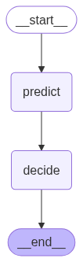

# 🛡️ Deteccion de Anomalias en registros Log

Este proyecto utiliza agentes en LangGraph y un modelo de machine learning para analizar datos de logs de entrada (UNSW-NB15) para identificar diferentes tipos de ataques (DoS, Exploits, Normal)

## Funcionalidades

- Procesamiento de registros estructurados (formato UNSW-NB15)
- Clasificación de registros mediante un modelo de machine learning
- Agentes que coordinan predicción y toma de decisiones
- Respuestas estructuradas con acciones sugeridas por registro

## 🏗️ Estructura del Proyecto

## 📁 Estructura del Proyecto

```text
agents/                 🧠 Lógica principal de los agentes usando LangGraph
├── tools/              Herramientas o componentes reutilizables (opcional)
└── keys.py             Claves API para los LLMs (debería estar en .gitignore)

app/                    🌐 Aplicación FastAPI que expone el agente como servicio API

data/                   📂 (Vacía) Carpeta reservada para archivos de entrada o logs de prueba

models/                 🤖 Código del modelo y exportaciones
└── exports/            Archivos del modelo exportado (.joblib, .pkl)

notebooks/              📒 Notebooks de Jupyter para pruebas, prototipado y análisis exploratorio
```

## 🧩 Descripción del Funcionamiento

La herramienta está expuesta a través de una API que recibe un lote de registros de entrada (logs) con el formato descrito en [📥 Ejemplo de Entrada](#-ejemplo-de-entrada).  

Estos registros pasan por un **flujo de agentes** que consta de dos etapas:



1. **Agente de Ingesta**  
   Es el encargado de recibir los logs, validarlos, formatearlos y realizar el llamado a la herramienta (`Tool`) disponible. Esta herramienta corresponde a un modelo de Machine Learning previamente entrenado que clasifica cada registro como normal o potencialmente anómalo.

2. **Agente de Decisión**  
   Recibe como entrada los resultados de la predicción anterior. A partir de ellos, realiza un análisis general del lote y recomienda una acción específica para cada registro (por ejemplo, "ignorar", "alertar" o "bloquear").

La estructura de la respuesta generada por el agente de decisión se describe en [📤 Ejemplo de Salida](#-ejemplo-de-salida).


### 📥 Ejemplo de Entrada

```json
[
  {
    "id": 1,
    "dur": 0.12,
    "proto": "tcp",
    "service": "-",
    "state": "FIN",
    "spkts": 6,
    "dpkts": 4,
    ...
  }
]
```

### 📤 Ejemplo de Salida

```json
{
  "whole_analysis": "🧠 Análisis general del sistema...",
  "analysis": [
    {"id": 1, "prediction": "NORMAL", "action": "IGNORE"},
    {"id": 2, "prediction": "DOS", "action": "BLOCK"}
  ]
}
```

---

## ⚙️ Instalación

### 1. Clona el repositorio
```bash
git clone https://github.com/paulguz261/meli_ai_challenge.git
cd meli_ai_challenge
```

### 2. Crea el archivo 'agents/keys.py' con tus claves API
Este archivo debe definir las siguientes variables:
   - API_KEY_GPT_MELI: tu clave de API de OpenAI
   - API_KEY_GEMINI_MELI: tu clave de API de Gemini

### Contenido de ejemplo para agents/keys.py:
   - API_KEY_GPT_MELI = "tu-clave-api-openai"
   - API_KEY_GEMINI_MELI = "tu-clave-api-gemini"

### 3. Crea y activa el entorno usando Conda
```bash
conda env create -f environment.yml
conda activate meli_ai_env
```

### 4. Inicia el servidor FastAPI
```bash
uvicorn app.main:app --reload
```
