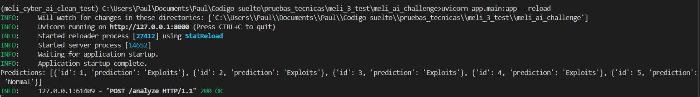
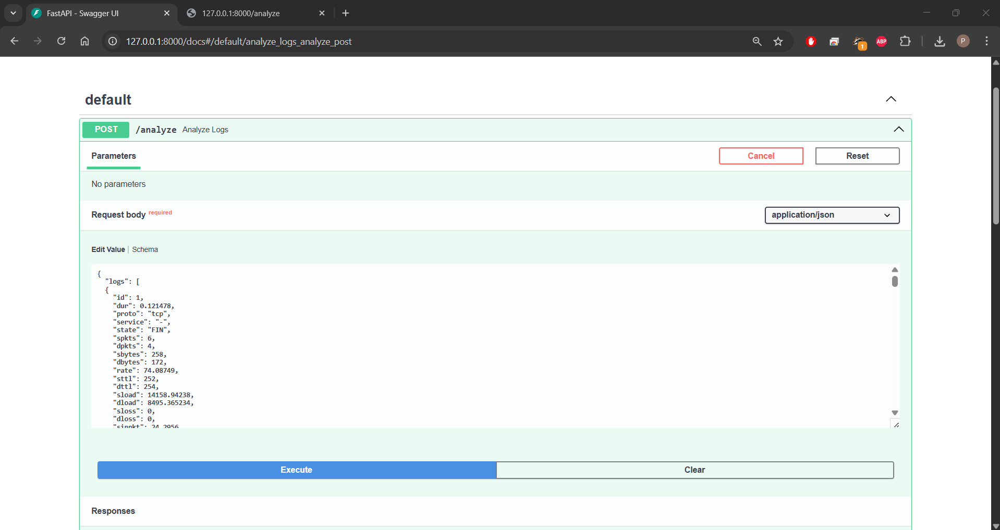
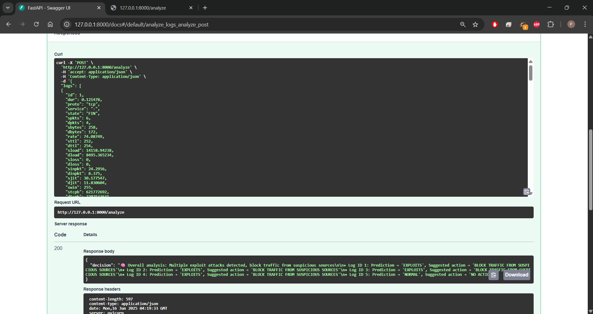

# 🛡️ Deteccion de Anomalias en registros Log

Este proyecto utiliza agentes en LangGraph y un modelo de machine learning para analizar datos de logs de entrada (UNSW-NB15) para identificar diferentes tipos de ataques (DoS, Exploits, Normal)

## Funcionalidades

- Procesamiento de registros estructurados (formato UNSW-NB15) [Dataset en Kaggle](https://www.kaggle.com/datasets/mrwellsdavid/unsw-nb15)
- Clasificación de registros mediante un modelo de machine learning
- Agentes que coordinan predicción y toma de decisiones
- Respuestas estructuradas con acciones sugeridas por registro

## 🏗️ Estructura del Proyecto

## 📁 Estructura del Proyecto

```text
agents/                 🧠 Lógica principal de los agentes usando LangGraph
├── tools/              Herramientas o componentes reutilizables (opcional)
└── keys.py             Claves API para los LLMs (debería estar en .gitignore)

app/                    🌐 Aplicación FastAPI que expone el agente como servicio API

data/                   📂 (Vacía) Carpeta reservada para archivos de entrada o logs de prueba

models/                 🤖 Código del modelo y exportaciones
└── exports/            Archivos del modelo exportado (.joblib, .pkl)

notebooks/              📒 Notebooks de Jupyter para pruebas, prototipado y análisis exploratorio
```

## 🧩 Descripción del Funcionamiento

La herramienta está expuesta a través de una API que recibe un lote de registros de entrada (logs) con el formato descrito en [📥 Ejemplo de Entrada](#-ejemplo-de-entrada).  

Estos registros pasan por un **flujo de agentes** que consta de dos etapas:


1. **Agente de Ingesta**  
   Es el encargado de recibir los logs, validarlos, formatearlos y realizar el llamado a la herramienta (`Tool`) disponible. Esta herramienta corresponde a un modelo de Machine Learning previamente entrenado que clasifica cada registro como normal o lo clasifica en alguna de las categorias de ataque que existen en el set de entrenamiento [informacion del modelo](#modelo-predictivo-de-ml).

2. **Agente de Decisión**  
   Recibe como entrada los resultados de la predicción anterior. A partir de ellos, realiza un análisis general del lote y recomienda una acción específica para cada registro (por ejemplo, "ignorar", "alertar" o "bloquear").

La estructura de la respuesta generada por el agente de decisión se describe en [📤 Ejemplo de Salida](#-ejemplo-de-salida).


### 📥 Ejemplo de Entrada

```json
[
  {
    "id": 1,
    "dur": 0.12,
    "proto": "tcp",
    "service": "-",
    "state": "FIN",
    "spkts": 6,
    "dpkts": 4,
    ...
  }
]
```

### 📤 Ejemplo de Salida

```json
{
  "whole_analysis": "🧠 Análisis general del sistema...",
  "analysis": [
    {"id": 1, "prediction": "NORMAL", "action": "IGNORE"},
    {"id": 2, "prediction": "DOS", "action": "BLOCK"}
  ]
}
```

---

## ⚙️ Instalación

### 1. Clona el repositorio
```bash
git clone https://github.com/paulguz261/meli_ai_challenge.git
cd meli_ai_challenge
```

### 2. Crea el archivo 'agents/keys.py' con tus claves API
Este archivo debe definir las siguientes variables:
   - API_KEY_GPT_MELI: tu clave de API de OpenAI
   - API_KEY_GEMINI_MELI: tu clave de API de Gemini

### Contenido de ejemplo para agents/keys.py:
   - API_KEY_GPT_MELI = "tu-clave-api-openai"
   - API_KEY_GEMINI_MELI = "tu-clave-api-gemini"

### 3. Crea y activa el entorno usando Conda
```bash
conda env create -f environment.yml
conda activate meli_ai_env
```

## Evidencia Funcionamiento

servicio API arriba

en esta imagen se ve que la api ha ejecutado el metodo /analyze de forma exitosa

evidencia de los log de entrada junto con la salida con el analizis de las acciones a realizar.
   - valores de entrada

   - valores de salida


**Analisis de salida**

```json 
{
  "decision": "🧠 Overall analysis: Multiple exploit attacks detected, block traffic from suspicious sources.

• Log ID 1: Prediction → 'EXPLOITS', Suggested action → 'BLOCK TRAFFIC FROM SUSPICIOUS SOURCES'
• Log ID 2: Prediction → 'EXPLOITS', Suggested action → 'BLOCK TRAFFIC FROM SUSPICIOUS SOURCES'
• Log ID 3: Prediction → 'EXPLOITS', Suggested action → 'BLOCK TRAFFIC FROM SUSPICIOUS SOURCES'
• Log ID 4: Prediction → 'EXPLOITS', Suggested action → 'BLOCK TRAFFIC FROM SUSPICIOUS SOURCES'
• Log ID 5: Prediction → 'NORMAL', Suggested action → 'NO ACTION'"
}
```

### 4. Inicia el servidor FastAPI
```bash
uvicorn app.main:app --reload
```

## Modelo predictivo de ML

Se realiza el entrenamiento de un modelo de prediccion a partir de los datos de entrada.

### Preprocesamiento de datos
1. Elimina los registros que tengan valores nulos
2. elimina las columnas que no son necesarias (ej. id)
3. Separa las variables en categoricas y numericas
   3.1 Variables numericas
      - Aplica logaritmo
      -  Estandariza los valores
   3.2 Variables categoricas
      - Reduce la cardinalidad toma el top 5 de categorias mas populares y a las restante las agrupa en la categoria otros
      -  aplica OneHotEncoding
  
### Modelo empleado
El modelo elegido fue un Gradient Boost Classifier que permite predecir las distintas categorias de ataque existentes en el set de prueba


## 📊 Distribucion de los datos de entrada

| Attack Category  | Count  | Percentage (%) |
|------------------|--------|----------------|
| Normal           | 29600  | 44.94          |
| Generic          | 15097  | 22.92          |
| Exploits         | 8905   | 13.52          |
| Fuzzers          | 4850   | 7.36           |
| DoS              | 3271   | 4.97           |
| Reconnaissance   | 2797   | 4.25           |
| Analysis         | 542    | 0.82           |
| Backdoor         | 466    | 0.71           |
| Shellcode        | 302    | 0.46           |
| Worms            | 35     | 0.05           |


## 📊 Reporte del modelo

| Class           | Precision | Recall | F1-score | Support |
|-----------------|-----------|--------|----------|---------|
| Analysis        | 0.82      | 0.07   | 0.12     | 135     |
| Backdoor        | 0.00      | 0.00   | 0.00     | 117     |
| DoS             | 0.45      | 0.56   | 0.50     | 818     |
| Exploits        | 0.69      | 0.70   | 0.70     | 2227    |
| Fuzzers         | 0.72      | 0.60   | 0.65     | 1212    |
| Generic         | 0.99      | 0.97   | 0.98     | 3774    |
| Normal          | 0.94      | 0.99   | 0.96     | 7400    |
| Reconnaissance  | 0.89      | 0.78   | 0.83     | 699     |
| Shellcode       | 0.65      | 0.53   | 0.58     | 76      |
| Worms           | 0.67      | 0.67   | 0.67     | 9       |

---

| Metric        | Precision | Recall | F1-score | Support |
|---------------|-----------|--------|----------|---------|
| Accuracy      |           |        | 0.87     | 16467   |
| Macro avg     | 0.68      | 0.59   | 0.60     | 16467   |
| Weighted avg  | 0.87      | 0.87   | 0.86     | 16467   |

## Analisis del modelo

El modelo logra identificar en buena medida los ataques catalogados como genericos, sin embargo tiene dficultades para identificar el resto, esto puede darse ya que proporcionalmente la presencia de estas otras categorias es menor y se le dificulta al modelo la caracterizacion del mismo.
El modelamiento de features fue mínimo, principalmente por que se trato como una prueba concepto y no se dedico tiempo al entendimiento profundo las variables; por lo que un proceso de feature engineering puede mejorar el desempeño general del modelo
La creacion de modelos dedicados a la prediccion de cada categoria puede ser tambien evaluado para mejorar el desempeño de las predicciones.

## Mejoras
1. Como se explico en la seccion anterior el modelo puede tener varias mejoras
2. El agente de decision puede tener una mjora en su prompt con contexto de la infraestructura o de las decisiones que se pueden tomar en cada caso, para esta primera entrega se dejo a consideracion del llm utilizado cual era la mejor opcion
3. Se pueden implementar mas agentes dependiendo de la complejidad de las decisiones que pueda tomar el agente frente al sistema existente, sin embargo como de momento no se conoce se deja todo el peso de la decision en un unico agente

